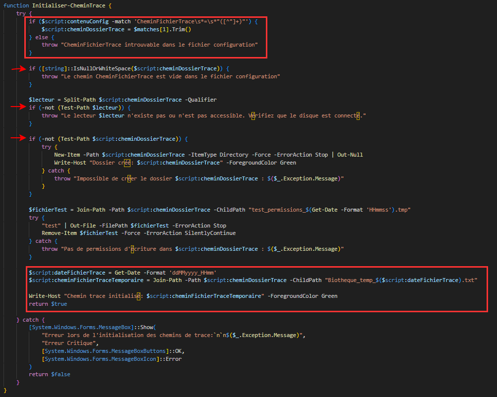
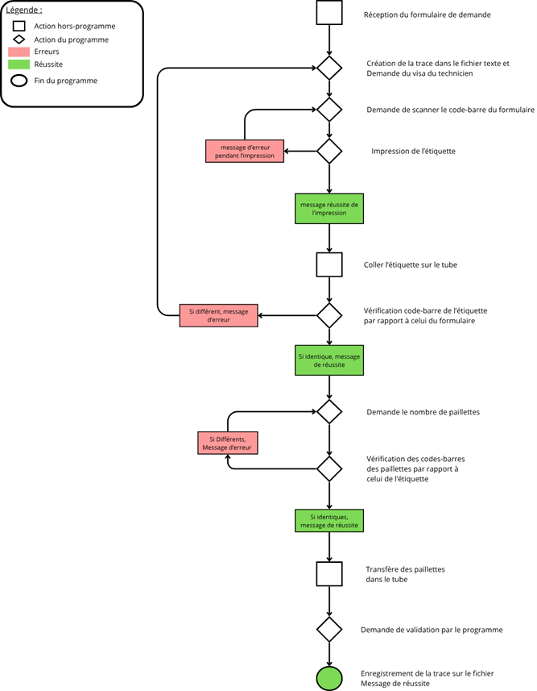
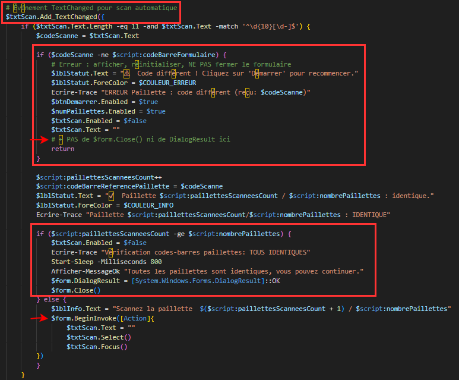
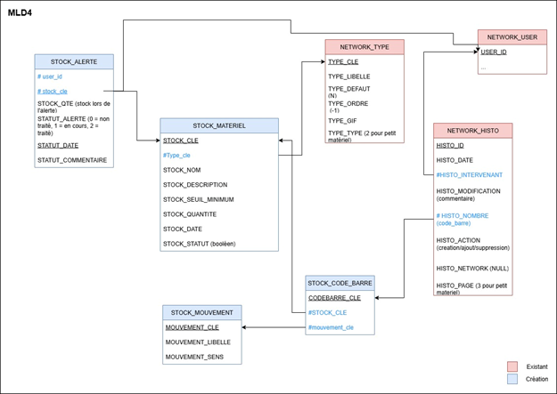
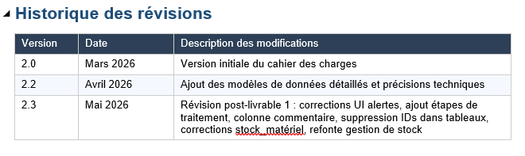
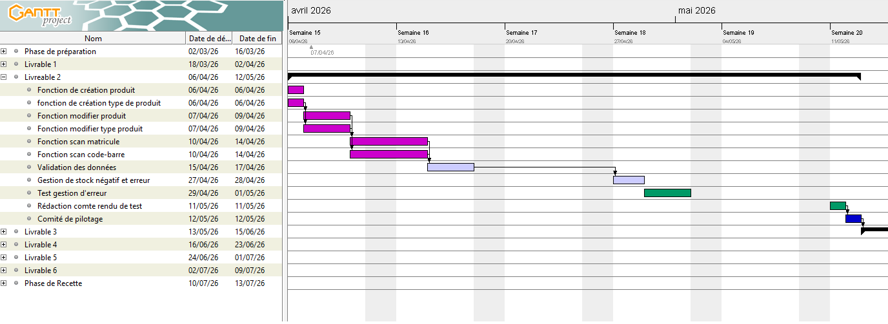
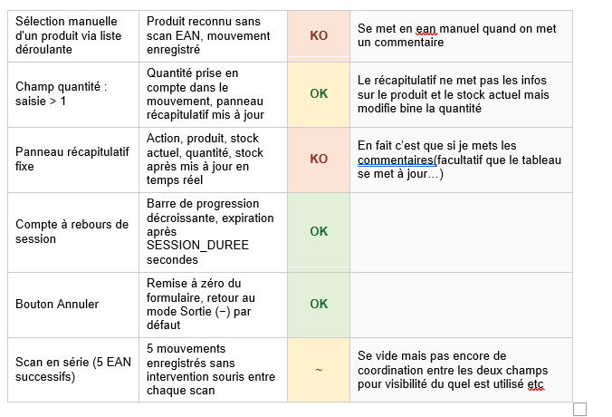
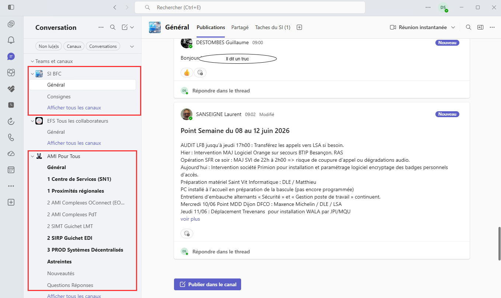
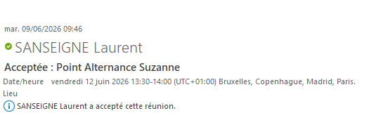
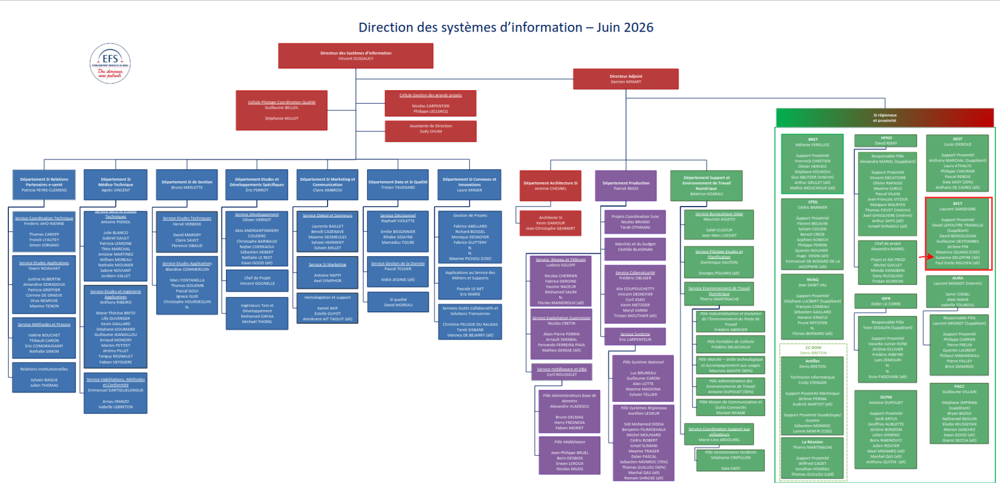

# Portfolio BUT 2

---

## 1. Page d'Accueil

**Objectif du site :**
Présenter mon travail, mes réalisations et l'évolution de mes compétences en tant qu'étudiante en BUT Informatique (IUT de Belfort), lors de mon alternance à l'Établissement Français du Sang (EFS) de Besançon.

---

**Contexte de l'entreprise (EFS) :**

L'EFS est un établissement public à caractère administratif (EPA), placé sous la tutelle du ministère chargé de la santé, créé le 1er janvier 2000. Il est chargé de collecter, préparer, qualifier et distribuer les produits sanguins labiles (sang, plasma, plaquettes) en France.

La région Bourgogne-Franche-Comté compte environ 550 collaborateurs répartis sur 8 sites. Le service informatique régional, que j'ai rejoint, est basé à Besançon. Depuis novembre 2025, les services informatiques de l'EFS sont unifiés au niveau national : le site de Besançon regroupe désormais plusieurs pôles (systèmes centralisés, décentralisés, etc.), favorisant une proximité essentielle pour le service support.

J'ai intégré cette équipe afin de répondre à des besoins de support et de maintenance informatique, tant au niveau régional que national. Mon rôle s'est également étendu au développement d'outils métiers spécifiques, destinés à sécuriser des processus locaux non couverts par les solutions nationales.

---

**Contexte des sujets d'alternance :**

*Sujet 1 : Sécurisation du processus de décantation de paillettes (Biothèque de Dijon — Projet "VerifEtiquette")*

- **L'existant et le problème :** La biothèque de Dijon est un laboratoire qui conserve des échantillons biologiques appelés **paillettes** — de fines pailles scellées contenant des cellules ou du matériel génétique — dans des cuves d'azote liquide. Lorsqu'un laboratoire d'analyse en fait la demande, une technicienne doit extraire les bonnes paillettes et les préparer pour l'envoi : c'est le processus de **décantation**. Chaque paillette porte un code-barres unique qui doit correspondre exactement au formulaire de demande du laboratoire. Une erreur de correspondance — confondre deux paillettes, coller une étiquette sur le mauvais tube — peut rendre un échantillon inutilisable et entraîner sa perte définitive. Jusqu'alors, ces vérifications étaient réalisées manuellement avec un fichier Excel, ce qui laissait la porte ouverte aux erreurs humaines et aux oublis.
- **Le sujet et les enjeux :** Concevoir une application pour automatiser et sécuriser chaque étape de ces vérifications. L'objectif est de rendre toute erreur immédiatement visible et bloquante, afin d'éviter qu'un échantillon mal identifié ne soit expédié. Le projet a été déployé avec succès en mars 2026. *(Le processus métier complet est détaillé dans la section Suivi de Projet, via le workflow de la Trace 2.)*

*Sujet 2 : Module de gestion de stock et alertes (Application DEDALE)*

- **L'existant et le problème :** Au sein du service informatique de Besançon, le suivi des petits matériels (câbles HDMI, souris, écrans de confidentialité, etc.) n'est pas automatisé. Les commandes n'étaient passées que lorsque le manque était constaté visuellement, causant des retards dans la mise à disposition du matériel aux utilisateurs.
- **Le sujet et les enjeux :** Développer et intégrer un module de gestion de stock avec système d'alertes au sein de l'application régionale existante DEDALE (en PHP/Oracle). Cet outil doit permettre au gestionnaire de parc d'avoir une vision en temps réel des stocks, d'assurer une traçabilité complète des mouvements, et de proposer une interface accessible via navigateur web ou via un Raspberry Pi équipé d'une douchette code-barres pour les saisies rapides. Le projet est actuellement en cours de déploiement.

---

**Savoir-faire généraux mobilisés :**
- **Savoir concevoir et développer une application** (de la modélisation à l'interface utilisateur, mis en œuvre sur les deux sujets).
- **Savoir gérer et intégrer des données** (manipulation de bases de données relationnelles Oracle, gestion d'historiques, intégration dans un existant).
- **Savoir organiser et conduire un projet informatique** (planification, recueil et vulgarisation des besoins, interaction avec des utilisateurs non-techniques).
- **Savoir s'intégrer et communiquer dans un environnement professionnel** (travail en équipe, entraide technique, documentation partagée).

---

## 2. Page Technique

*(Résumé introductif : Cette section détaille les compétences techniques mises en œuvre lors du développement des deux applications. J'y démontre ma capacité à concevoir une architecture logicielle maintenable, à gérer des entrées matérielles contraintes, et à intégrer de nouvelles fonctionnalités dans une base de données et un code existants.)*

### Projet 1 : Application VerifEtiquette (PowerShell / .NET WinForms)

- **Développement d'interfaces et IHM :** Création d'un programme en PowerShell intégrant une interface graphique avec le framework .NET WinForms. J'ai anticipé les erreurs de saisie : marqueurs rouges dynamiques pour les erreurs de format, pop-ups bloquantes pour les erreurs de validation (visa non reconnu, imprimante indisponible), messages de confirmation à chaque étape du processus.
- **Gestion des paramètres et impression :** Génération et impression d'étiquettes au format ZPL. Séparation entre les variables internes du script et les paramètres modifiables externalisés dans un fichier `.ini` (nom de l'imprimante, chemin des traces, liste des visas autorisés).

### Projet 2 : Module de gestion de stock DEDALE (PHP / Oracle / JavaScript)

- **Développement web et asynchronisme :** Intégration dans une application existante des années 2000, en PHP sans framework. Pour dynamiser l'interface sans rechargement de page, j'ai utilisé AJAX (Asynchronous JavaScript and XML), technique permettant au navigateur d'envoyer et de recevoir des données du serveur en arrière-plan.
- **Logique algorithmique et structure de données :** Suite à une réflexion sur la cohérence entre les champs de saisie (code-barres et quantité), j'ai conçu un buffer de scan utilisant la clé produit comme identifiant unique. Cette réflexion m'a amené à découvrir que les tableaux PHP sont nativement des maps associatives (clé → valeur), rendant l'implémentation côté serveur directement compatible. Mon collègue David Benssoussan a suggéré l'utilisation d'un tableau ; j'ai identifié la structure Map comme solution au problème de cohérence inter-champs.
- **Base de données :** Intégration de nouvelles tables dans une base Oracle existante, en respectant les conventions en place (nommage, types d'attributs, gestion des historiques). Accès aux données via les fonctions natives `db.fetch` et `db.execute` en PHP.

---

### Traces Techniques

**Trace 1 : Architecture modulaire et documentation nationale (VerifEtiquette)**

*Savoir-faire illustrés : Concevoir une architecture logicielle maintenable par des non-développeurs, rédiger une documentation opérationnelle destinée à des techniciens tiers.*

*Description :* Dans la trace 1.1 montrant le code qui initalise le chemin trace, la fonction `Initialiser-CheminTrace`. Elle lit d'abord le chemin du dossier de traces dans l'encradé rouge  dans le fichier de configuration `.ini`, puis enchaîne une série de vérifications défensives (flèches rouges): existence du lecteur réseau, existence du dossier cible (créé automatiquement si absent), et permissions d'écriture testées via un fichier temporaire. En cas d'échec à n'importe quelle étape, une exception explicite est levée avec un message d'erreur contextualisé.

Ce choix d'architecture répond à une contrainte concrète : je suis la seule développeuse de cette application, et les utilisatrices de la biothèque doivent pouvoir modifier certains paramètres sans intervenir sur le code. Le fichier `.ini` externalise trois éléments : le nom de l'imprimante, le chemin des fichiers de trace, et la liste des visas techniciens autorisés que l'on voit dans la trace 1.2 du document où l'on voit le fichier .ini. Cela permet, par exemple, d'ajouter le visa d'un nouveau collaborateur sans aucune modification du script.

Pour garantir la maintenabilité au-delà de ma présence, j'ai rédigé une fiche de documentation publiée sur la plateforme nationale XWiki de l'EFS (trace 1.2 et 1.3). Accessible à tous les techniciens de support au niveau national, cette fiche décrit l'arborescence du dossier programme, le fonctionnement du fichier `.ini`, les dysfonctionnements typiques et les commandes PowerShell de diagnostic associées. Concrètement, si un technicien AMI national est appelé pour un incident sur ce poste à Dijon, il peut consulter cette fiche sans avoir à me contacter — ce qui était l'un des objectifs explicites de la conception.

---

**Trace 2 : Modélisation du processus métier (VerifEtiquette)**

*Savoir-faire illustrés : Traduire un processus métier en logique de programmation, valider la compréhension du besoin avec un interlocuteur non-informaticien.*

*Description :* Ce workflow (trace 2)a été réalisé dès la première réunion avec la biothèque, pour formaliser le processus de décantation et en déduire la logique applicative. Il a évolué à plusieurs reprises au fil des échanges pour intégrer de nouvelles règles de gestion, comme la validation des visas techniciens. Il constitue le support utilisé pour confirmer avec l'utilisatrice que le comportement attendu du programme correspond bien à la réalité du terrain. Il a été difficile de se mettre d'accord sur quand est-ce qu'il fallait coller l'etiquette sur le tube, est-ce qu'il fallait d'abord scanner les paillettes, car le processus n'était pas officiellement incrit quelque part. 

Le processus modélisé est le suivant : réception du formulaire de demande, impression de l'étiquette et vérification de son code-barres par rapport au formulaire, scan séquentiel de chaque paillette pour contrôler sa conformité, puis transvasement dans le tube d'envoi. Le workflow précise également les étapes journalisées dans les fichiers traces, les erreurs bloquantes, et les points de redirection en cas d'anomalie.

---

**Trace 3 : Algorithme de vérification séquentielle des paillettes (VerifEtiquette)**

*Savoir-faire illustrés : Concevoir un algorithme de vérification adapté aux contraintes matérielles, gérer l'état d'un formulaire GUI en environnement événementiel.*

*Description :* Cet extrait de code (trace 3) montre le gestionnaire d'événement `TextChanged`, déclenché automatiquement à chaque scan( premier encadré rouge). Il valide d'abord la longueur du code (11 caractères) et son format via une expression régulière, puis compare le code scanné au code de référence issu du formulaire. En cas de non-conformité, l'erreur est consignée dans le fichier de trace et l'utilisatrice est invitée à rescanner, sans interrompre le processus (deuxième encadré rouge). Si le code est valide, un compteur s'incrémente ; une fois toutes les paillettes validées, une pop-up de confirmation s'affiche et le formulaire se ferme avec un résultat de succès(troisième encadré rouge).

Un détail notable : le commentaire `# PAS de $form.Close() ni de DialogResult ici` (première flèche rouge) en cas d'erreur n'est pas une explication générale — c'est une note de décision d'architecture. Fermer le formulaire en cas d'erreur aurait terminé l'étape en cours et forcé un redémarrage du processus depuis le début. Le choix a été fait de maintenir le formulaire ouvert, de signaler l'erreur visuellement en rouge, et de permettre un nouveau scan sans perdre le contexte de l'opération.

Le `BeginInvoke([Action]{...})` (deuxième flèche rouge)utilisé pour vider le champ après chaque lecture répond à une contrainte matérielle : une douchette code-barres envoie ses caractères très rapidement. Appeler `$txtScan.Text = ""` directement dans le gestionnaire `TextChanged` risque de déclencher un nouvel événement avant que le traitement du scan en cours soit terminé, provoquant des lectures partielles ou des validations ratées. `BeginInvoke` reporte cette réinitialisation après la fin du traitement en cours, garantissant qu'aucune paillette ne soit ignorée ou mal validée lors d'un passage rapide de la douchette.

---

**Trace 4 : Gestion du buffer de scan et soumission automatique (DEDALE)**

*Savoir-faire illustrés : Concevoir une logique de gestion d'état adaptée aux contraintes d'usage, implémenter un mécanisme de buffer en JavaScript, identifier la structure de données adaptée à un problème de cohérence inter-champs.*

*Description :* Ces deux fonctions de la trace 4, implémentent la logique de buffer de scan, conçue pour permettre à un utilisateur de scanner plusieurs produits différents à la suite avec une douchette, sans manipulation manuelle entre chaque produit.

À chaque scan EAN, le système vérifie si le code correspond au produit dans le buffer. Si c'est le même produit, la quantité est incrémentée sans soumission immédiate. Si c'est un produit différent, le buffer est soumis automatiquement — enregistrant le mouvement de stock — et une nouvelle session commence avec le nouveau produit. La fonction `onSessionExpire()` déclenche le même mécanisme à l'expiration du compte à rebours : si un scan est en attente, il est soumis avant réinitialisation ; sinon, la session reste active avec le même sens d'action (entrée ou sortie), évitant à l'utilisateur de devoir le resélecter.

La soumission est réalisée via `requestSubmit()` avec un fallback sur `submit.call()` pour la compatibilité navigateur, sans passer par le bouton visible — ce qui garantit l'exécution de la logique de validation du formulaire.

Ce buffer est né d'un problème de cohérence : les deux champs du formulaire (code-barres et quantité) étaient liés à deux variables séparées, rendant la vérification avant soumission complexe. En regroupant les données d'un scan dans une structure unique indexée par la clé produit, la vérification se réduit à tester l'existence d'une seule variable. C'est au cours de cette réflexion que j'ai découvert que les tableaux PHP sont nativement des maps associatives (clé → valeur), rendant l'implémentation côté serveur directement compatible.

---

**Trace 5 : Intégration dans une base de données existante (DEDALE)**

*Savoir-faire illustrés : Concevoir et intégrer de nouvelles tables dans une base de données existante, justifier des choix de modélisation en cohérence avec l'existant.*

*Description :* Le Modèle Logique de Données (MLD) distingue visuellement les tables existantes (rose) et les tables créées pour le module (bleu). Les nouvelles tables ont été nommées et typées en cohérence avec les conventions de la base Oracle existante, pour assurer la maintenabilité par l'équipe après ma période d'alternance.

Deux choix de modélisation méritent justification. Le champ `STATUT_ALERTE` dans la table `STOCK_ALERT` utilise un entier (0, 1) plutôt qu'une table de référence dédiée : deux états fixes ne justifiaient pas une table supplémentaire, à condition que les valeurs soient documentées — ce qui est le cas dans le cahier des charges. De même, `STOCK_STATUT` dans la table `STOCK_MATERIEL` est un booléen permettant de désactiver un produit sans le supprimer, afin de préserver l'historique des mouvements. Ces choix pragmatiques ont été validés avec l'équipe et documentés.

La table `STOCK_MOUVEMENT` référence des codes-barres physiques correspondant aux étiquettes collées sur le Raspberry Pi (codes d'incrément et de décrément), auxquels s'ajoute une option de correction manuelle pour le gestionnaire de parc.

Le dictionnaire de données joint précise pour chaque attribut de `NETWORK_HISTO` son rôle dans le module, les valeurs attendues et les contraintes. Ce document a été utilisé lors des réunions de validation pour s'assurer que les données enregistrées correspondaient aux besoins métier.

---

**Bilan du niveau d'expertise Technique**

- **Niveau atteint : Bon.**
- **Justification :**

  Sur VerifEtiquette, j'ai su concevoir une architecture adaptée à un environnement contraint (utilisatrices non-techniques, matériel spécifique, absence de développeur en support local) et anticiper des problèmes liés à la vitesse d'une douchette code-barres — une contrainte que les cours ne m'avaient pas préparée à rencontrer. Sur DEDALE, j'ai appris à intégrer dans du code existant, à utiliser AJAX pour dynamiser une interface sans la refondre, et à raisonner sur les structures de données en JavaScript et PHP.

  Deux limites sont clairement identifiées. Sur VerifEtiquette, le découpage en plusieurs fenêtres distinctes alourdit la gestion de l'interface ; avec du recul, une fenêtre unique à contenu dynamique aurait été plus maintenable. Sur DEDALE, je m'appuie encore fortement sur les patterns du code PHP existant : cela me permet d'avancer efficacement, mais limite ma compréhension des mécanismes sous-jacents — notamment sur les raisons pour lesquelles certaines fonctions de versions récentes de PHP ne fonctionnent pas dans l'environnement en place.

---

## 3. Page Suivi de Projet

*(Résumé introductif : Cette page illustre ma capacité à analyser des besoins, planifier des tâches et assurer le suivi de projets informatiques en communiquant efficacement avec des acteurs non-techniques.)*

### Pilotage et documentation

- **Analyse et vulgarisation des besoins :** Les cours de Communication et de Gestion de Projet du BUT m'ont aidée à structurer mes échanges avec les utilisatrices de la biothèque. J'ai réalisé des workflows et rédigé des cahiers des charges accessibles à des interlocuteurs sans formation informatique.
- **Planification :** Création de diagrammes de Gantt permettant de partager un état d'avancement visuel lors des réunions de pilotage, en intégrant les contraintes d'alternance.
- **Documentation et tests :** Rédaction de documentations fonctionnelles et réalisation de rapports de tests, mis à jour régulièrement et partagés avec l'équipe via un répertoire commun.

---

### Traces Suivi de Projet

**Trace 6 : Planification et suivi temporel (DEDALE)**

*Savoir-faire illustrés : Planifier un projet en livrables, anticiper les dépendances, estimer la charge de travail dans un contexte d'alternance.*

*Description :* Ce diagramme de Gantt structure le projet en six livrables. Le premier a été dédié à la prise en main de l'existant et de la base de données, avec affichage des données via des jeux d'essais — choix délibéré pour ne pas développer sur une base mal comprise. Le deuxième livrable constitue le cœur fonctionnel (gestion de stock). La planification intègre les alternances semaines école/semaines entreprise pour rester réaliste. Des retards ont été accumulés en raison d'anomalies imprévues et de shifts de maintenance nationale ; ils ont conduit à réévaluer les priorités et à reporter certaines fonctionnalités aux livrables suivants.

---

**Trace 7 : Tests et assurance qualité**

*Savoir-faire illustrés : Définir et exécuter un plan de tests, identifier les comportements inattendus liés à l'environnement matériel.*

*Description :* La première image de la trace 7 présente les tests de recette réalisés pour VerifEtiquette avant déploiement. Cette démarche a permis d'identifier un comportement inattendu lié à l'environnement matériel : la douchette de l'utilisatrice envoyait une tabulation au lieu d'une validation en fin de scan, nécessitant un ajustement du programme.

La deuxième image de la trace 7 illustre le rapport de tests du livrable 2 de DEDALE. Un rapport est initialisé à chaque nouveau livrable, liste les fonctionnalités attendues, puis est mis à jour régulièrement. Il est partagé avec l'équipe via un répertoire commun, assurant une visibilité sur l'état d'avancement entre les périodes en entreprise et les semaines école. Les codes couleurs et commentaires permettent à un collègue de reprendre le contexte rapidement.

---

**Trace 8 : Évolution du cahier des charges (DEDALE)**

*Savoir-faire illustrés : Maintenir une documentation projet vivante, gérer les évolutions du besoin en cours de développement.*

*Description :* Suite au comité de pilotage du premier livrable, le cahier des charges a été mis à jour pour intégrer les retours de l'équipe ( encadré rouge de la trace 8), matérialisés par des ajouts surlignés en jaune. Un historique des versions est maintenu pour distinguer les besoins initiaux des évolutions demandées en cours de projet. Le document comprend 12 parties et intègre notamment les critères de recette, permettant de définir objectivement les conditions de validation de chaque livrable.

---

**Bilan du niveau d'expertise en Gestion de Projet**

- **Niveau atteint : Très bon.**
- **Justification :**

  J'ai acquis la capacité à produire et maintenir des documents de suivi utilisables par l'ensemble du service : workflows, diagramme de Gantt, cahier des charges évolutif, rapports de tests. Ces documents ont joué un rôle concret dans la coordination avec les utilisatrices et dans la continuité du projet entre les périodes en entreprise et les semaines école.

  Un axe de progression identifié concerne la qualité de mes notes de travail en cours de développement. Lorsque je suis en phase active de développement, je prends des notes rapidement, au fil de la pensée, sans toujours les relire avant de passer à l'étape suivante. Il m'arrive de ne plus comprendre mes propres annotations quelques jours plus tard. Ces notes restent un support personnel avant leur mise en forme finale — mais cela m'indique que la rigueur de documentation doit s'appliquer dès la prise de notes, pas seulement à la finalisation.

---

## 4. Page Intégration en Entreprise

*(Résumé introductif : L'intégration au sein d'une équipe technique en pleine transition nationale a requis adaptabilité, autonomie et communication proactive avec des profils variés.)*

### Environnement de travail et communication

- **Contexte :** Je travaille dans un open space avec les collègues du support informatique. Cette proximité favorise les échanges informels et permet de capter des informations de contexte en direct — incidents en cours, priorités du service, retours d'expérience des techniciens.
- **Outils de communication :** Utilisation quotidienne de Microsoft Teams (canaux régionaux et nationaux d'entraide) et des mails pour le suivi des actualités et la coordination technique.

### Collaboration et accompagnement

- Sur le projet DEDALE, j'ai travaillé régulièrement avec David Benssoussan. Nos domaines techniques diffèrent, mais nos échanges ont abouti à des solutions concrètes. Je soumets régulièrement mon code à sa relecture pour m'assurer de sa maintenabilité dans le contexte de l'application existante.
- Des points réguliers avec mon responsable Laurent Sanseigne structurent le suivi de mon activité, en complément d'une communication informelle au quotidien.

---

### Traces Intégration en Entreprise

**Trace 9 : Utilisation des canaux collaboratifs nationaux**

*Savoir-faire illustrés : Identifier les bons interlocuteurs dans une organisation étendue, utiliser les outils collaboratifs de manière proactive pour débloquer des situations techniques.*

*Description :* L'EFS dispose de canaux Teams nationaux organisés par domaine (infrastructure, EDI, poste de travail, applications, etc.).Le premier encadré rouge montre les canaux régionaux et le deuxième encadré montre les différents canaux nationaux avec plusieurs services que l'on peut contacté en cas de problème. 
En cas de blocage technique, j'utilise ces canaux pour solliciter directement les experts compétents au niveau national, plutôt qu'attendre une escalade hiérarchique. Cette organisation s'appuie également sur une réunion d'entraide AMI quotidienne, active toute la journée de shift national : elle permet de poser des questions en direct, de tagger un service ou une personne sur un ticket, et d'obtenir une réponse rapide — soit vers la bonne fiche de documentation sur XWiki, soit via une explication en temps réel. Cette démarche m'a permis de résoudre des situations que mon périmètre régional seul n'aurait pas pu traiter.

---

**Trace 10 : Suivi managérial régulier**

*Savoir-faire illustrés : Rendre compte de son activité, s'inscrire dans une relation hiérarchique structurée.*

*Description :* Cet extrait de calendrier Outlook de la trace 10 illustre l'organisation de points réguliers avec mon responsable. Ces réunions sont l'occasion de faire le bilan des avancées, de partager les difficultés rencontrées et d'aligner les priorités avec les objectifs du service. Elles complètent les échanges informels du quotidien et assurent un suivi formalisé de mon activité.

---

**Trace 11 : Positionnement dans l'organisation**

*Savoir-faire illustrés : Comprendre l'organisation d'un service informatique, identifier les interlocuteurs selon leur rôle.*

*Description :* Vous pouvez voir où je me situe dans le service national grace à l'encadré rouge et la flèche de la trace 11. Cet organigramme de la DSI m'a permis, dès mon arrivée, de situer mon équipe (support proximité) dans l'organisation générale et d'identifier à qui m'adresser selon les types de demandes (infrastructure, LMT, EDI, systèmes décentralisés, etc.). Il m'a également aidée à comprendre l'impact de la restructuration nationale sur l'organisation du service, et à adapter ma communication en fonction du niveau et du rôle de mon interlocuteur.

---

**Bilan du niveau d'expertise en Intégration**

- **Niveau atteint : Bon.**
- **Justification :**

  Mon intégration s'est construite progressivement dans un contexte de forte charge pour l'équipe, mobilisée par la migration Windows 11 et la restructuration nationale du service informatique. J'ai su m'adapter à cet environnement en trouvant ma place à la fois sur le plan professionnel et humain : participation aux échanges du quotidien, disponibilité pour les collègues, et implication dans la vie du service au-delà de mes seules missions de développement.

  Sur le plan technique, j'ai gagné en autonomie en apprenant à utiliser les ressources disponibles (XWiki, canaux Teams, réunions AMI) pour avancer sans dépendre systématiquement de mes collègues directs. Un axe de progression reste la gestion des situations où mes priorités de développement entrent en tension avec des sollicitations de support imprévues — un équilibre que j'apprends à trouver au fil de l'alternance.